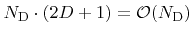
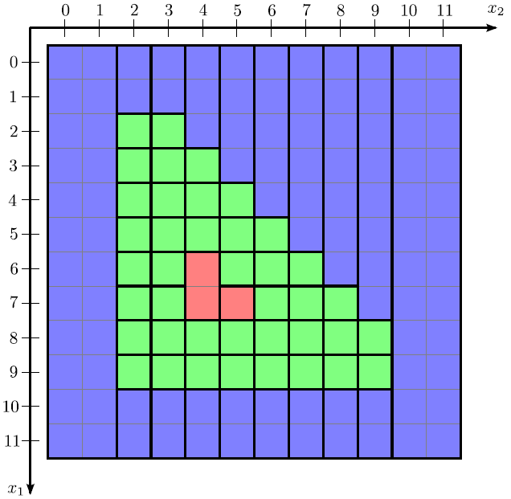
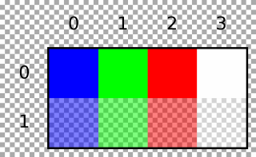
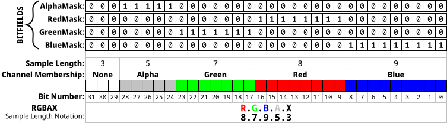

# Run-Length-Encoding
Run-Length Encoding (RLE) 
# What is a RLE ?
The RLE data structure is also able to store the sign of the LS function for all undefined grid points, while the DTG has ideal linear scaling memory requirements and is adaptive in all grid directions. A data structure that combines the advantages of the RLE and DTG data structures is the hierarchical run-length encoded (H-RLE) data structure.

As shown in Figure the H-RLE data structure is hierarchically organized, similar to the DTG. However, instead of storing sequences of defined grid points, which are projected to the same grid point in the lower dimensional space, run-length encoding is applied. Hence, the H-RLE data structure is able to store the sign of the LS function for all undefined grid points and, in addition, it shows the same characteristics regarding memory consumption and random access as the DTG.
<p align="center">

</p>

The H-RLE data structure leads to an inherent segmentation of the entire grid. All grid points either belong to an undefined run or are defined grid points. Figure shows the corresponding segmentation of the two-dimensional example given in Figure. The number of segments for the worst case is 

<p align="center">

</p>

However, if many defined grid points are neighbored, which is a common case for the LS method, the number of segments is much smaller.

<p align="center">

</p>

# BPM format 
<p align="center">

</p>

<p align="center">

</p>

# How to use ? 
```
gcc main.c
./a.out yourpicture.bmp
```
